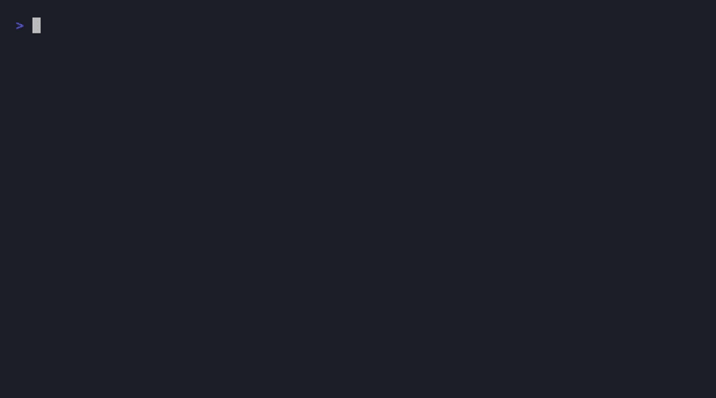

# errordoc

Pipe your errors, get actual answers. No more googling stack traces at 2am.

[](https://www.npmjs.com/package/@nixxx19/errordoc)
[](https://opensource.org/licenses/MIT)



## before / after

**without errordoc** — you get this and start googling:
```
node:internal/modules/cjs/loader:1078
  throw err;
  ^
Error: Cannot find module 'express'
Require stack:
- /app/src/server.js
    at Module._resolveFilename (node:internal/modules/cjs/loader:1075:15)
    at Module._load (node:internal/modules/cjs/loader:920:27)
    at Module.require (node:internal/modules/cjs/loader:1141:19) {
  code: 'MODULE_NOT_FOUND',
  requireStack: [ '/app/src/server.js' ]
}
```

**with errordoc** — you get this and fix it in 5 seconds:
```
  ✖ MODULE_NOT_FOUND  95% match

  The npm package "express" is not installed.
  It's either missing from package.json or not yet installed.

  Fixes:
  ⚡ Install the missing package
    $ npm install express
  ⚡ If using TypeScript, install type definitions
    $ npm install -D @types/express
```

## what is this

You know those errors that make you open 4 browser tabs? This tool just tells you what's wrong and how to fix it. Directly in your terminal.

- 100+ error patterns — Node, TypeScript, React, Next.js, Python, Rust, Go, Prisma, Mongo, Postgres, Docker, Git
- zero dependencies
- catches typos (`exprss` → did you mean `express`?)
- gives you actual commands to run, not just explanations
- works with any language

## install

```bash
npm install -g @nixxx19/errordoc
```

## usage

```bash
# pass the error directly
errordoc "Cannot find module 'express'"
errordoc "TypeError: Cannot read properties of undefined"

# auto-fix mode — prompts to run safe fixes
errordoc fix "Cannot find module 'express'"

# pipe build errors
npm run build 2>&1 | errordoc
cargo build 2>&1 | errordoc

# pipe from a log file
errordoc < error.log

# json output for CI
errordoc --format json < error.log

# watch mode
errordoc --watch < /var/log/app.log
```

> `2>&1` redirects stderr to stdout so the pipe can catch error output

## config

drop a `.errordocrc.json` in your project root or home directory:

```json
{
  "maxResults": 3,
  "minConfidence": 0.5,
  "format": "text",
  "noColor": false,
  "ignore": ["react-key-warning", "node-cors"]
}
```

CLI flags override the config file.

## use it in code

```typescript
import { analyze, explain } from '@nixxx19/errordoc';

const result = analyze("TypeError: Cannot read properties of undefined (reading 'map')");
console.log(result.matches[0].explanation);
// → You're trying to access "map" on undefined...

// or quick mode
const match = explain("ECONNREFUSED 127.0.0.1:5432");
// → Connection refused. PostgreSQL is not running...
```

```typescript
// options
analyze(errorText, {
  maxResults: 3,
  minConfidence: 0.5,
  format: 'json',
});
```

## what it catches

**languages** — Node.js (MODULE_NOT_FOUND, ECONNREFUSED, EADDRINUSE, CORS, etc), TypeScript (15 TS error codes), Python (ModuleNotFound, KeyError, AttributeError, IndentationError, etc), Rust (borrow checker E0382/E0502/E0505, lifetimes, traits, cargo), Go (nil pointer, deadlock, import cycle, unused imports)

**frameworks** — React (hooks, hydration, keys, max update depth), Next.js (server components, dynamic server usage, image config), Vite, Webpack, ESLint

**databases** — Prisma (P1001-P2025), MongoDB (duplicate key, auth, connection), PostgreSQL (missing tables/columns, syntax)

**cloud** — AWS (AccessDenied, NoSuchBucket, Lambda timeout/OOM, ExpiredToken), Firebase (auth errors, permission denied, DEADLINE_EXCEEDED), Supabase (RLS violations, PGRST errors, JWT)

**infra** — Docker (daemon down, port conflicts, disk space, missing images), Git (merge conflicts, detached HEAD, SSH auth), npm (ERESOLVE, E404, peer conflicts), Tailwind/PostCSS errors

**misc** — JWT expired/malformed, OAuth errors, 401/403, CSRF, OOM, segfaults, event loop blocked, worker thread errors

## how it works


1. strips ANSI codes from your terminal output
2. auto-detects what framework/language you're using
3. runs through 101 matchers ordered most-specific-first
4. fuzzy matches module names with levenshtein distance
5. ranks results by confidence and shows the best matches

## project structure

```
src/
├── engine.ts           core matching logic
├── formatter.ts        terminal / json / markdown output
├── cli.ts              cli entry point
├── types.ts            typescript types
├── matchers/
│   ├── node-module.ts      module resolution
│   ├── node-runtime.ts     TypeError, ReferenceError, etc
│   ├── node-network.ts     ECONNREFUSED, CORS, timeouts
│   ├── typescript.ts       TS error codes
│   ├── react.ts            hooks, hydration, keys
│   ├── nextjs.ts           server components, builds
│   ├── python.ts           python-specific errors
│   ├── rust.ts             borrow checker, lifetimes
│   ├── go.ts               nil pointer, deadlock
│   ├── database.ts         prisma, mongo, postgres
│   ├── build-tools.ts      webpack, vite, eslint, docker
│   └── misc.ts             jwt, oom, git, permissions
└── utils/
    ├── levenshtein.ts      typo detection
    └── extract.ts          regex helpers, framework detection
```

## contributing

```bash
git clone https://github.com/Nixxx19/errordoc.git
cd errordoc
npm install
npm run dev       # watch mode
npm test          # run tests
```

adding a matcher is straightforward — create a `Matcher` object with `test()` and `match()`, drop it in `src/matchers/`, register it in the index, add a test. check existing matchers for the pattern.

## license

MIT
